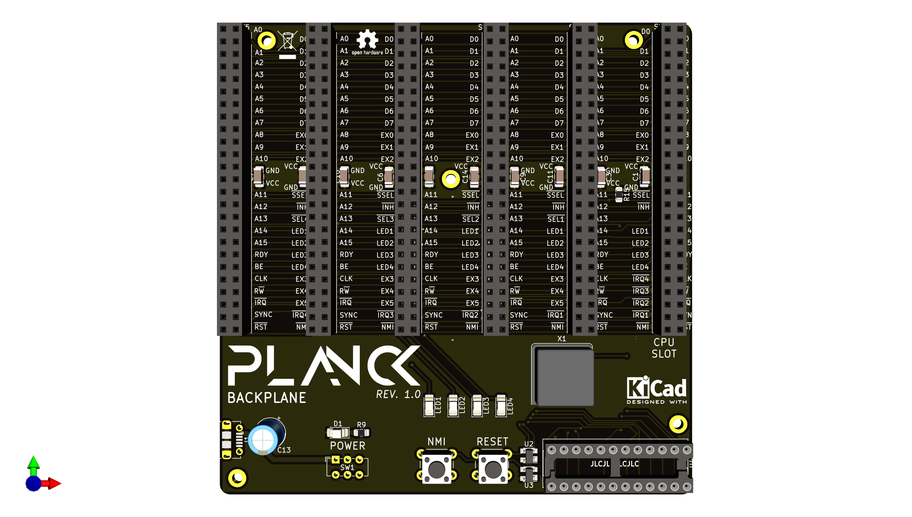

## Planck backplane
This is the backplane of the Planck 6502 computer.
A backplane is a mostly passive board where the daughter boards that actually provide functionality plug in to.

This backplane provides the power input (power is unregulated so you will need to provide a regulated power supply such as a usb adapter). A micro USB socket is provided for this purpose.

### Built in I/O

There is one power switch as well a two push buttons.
The first one triggers the reset pin via a MAX811 reset IC (which also provides power on reset)

The second push button triggers the NMI pin which triggers a "soft reset" of the computer.

In addition to the power LED, there are 4 LEDs that are connected to the expansion bus and can be turned on or off by expansion cards.

### Expansion cards 

There is built in address decoding logic for the expansion slots in the form of a GAL22V10 chip or equivalent. The decoding is very basic and simply sets a signal low that goes to one of the 5 expansion slots. Each expansion card is then responsible for trigerring itself when that signal is low. 

The address range available to each slot can be changed by simply reprogramming the GAL22V10 chip. By default the range `$FF80` to `$FFCF` is reserved for expansion cards. That is 16 bytes of address range for each of the 5 expansion slots

Expansion cards are not forced to honor their select line, it's just the range where they can be sure that the CPU board RAM or ROM will be disconnected from the data bus. We can therefore have a card like a RAM expansion board that can use banking to replace any address range, simply by asserting the INH signal when necessary.
Expansion cards must disconnect from the bus when another slot address range is called, or risk getting bus contention.

### CPU card slot

Slot 0 is special in that it is meant to host the CPU board, which also contains the base RAM and ROM. As such it has no select line, but a signal which indicates if any of the expansion board is selected, so that the rom and ram can be put offline.

A INH signal has also been added. This signal inhibits the built in ROM and RAM on the CPU board and let's the expansion board take over the bus (except for the range reserved for other expansion boards)

### Built-in clock

The onboard oscillator provides the base clock. It is divided by two to provide a stable clock to the peripherals that require it through the `CLK_12M` signal. Cards can assert the SLOW signal to require a slower clock. In that case the clock signal goes through a counter that divides the clock further. This is the `CLK` signal and is the only one that the CPU board listens to.

### Expansion bus signals

Most pins correspond to the pins of the same name on the CPU.

Below are the pins that are specific to the expansion bus:

| Pin | Description |
|-----   |-------------|
| EX0-EX2 | 3 expansion pins that are reserved for future use or can be used for communication betwen two expansion cards.|
| EX3-EX5 | 3 more expansion pins that can be used for card to card communications. These are not connected to lot zero because slot 0 uses these pins to receive IRQs from the expansion cards|
| INH|When low, this signal inhibits the RAM and ROM present on the CPU card and allows an expansion card to take over the whole bus (except expansion region).|
|SEL1-SEL5|The expansion card in the slot in which this signal is low should activate.|
|SSEL| Slot selected. The cpu card and any other card should disable all bus access when this signal is low and their own select signal (SEL1-SEL5) is high.|
|LED1-LED4| Debug leds 1 to 4.|
| IRQ1-IRQ5|Should be used by expansion cards when they want to signal an IRQ. All 5 lines are ANDed together on the processor board and pull the IRQ line low when at least one of them is low.|

### Board view

This is what the board looks like at the moment

 This documentation is licensed under a <a rel="license" href="http://creativecommons.org/licenses/by-sa/4.0/">Creative Commons Attribution-ShareAlike 4.0 International License</a>.