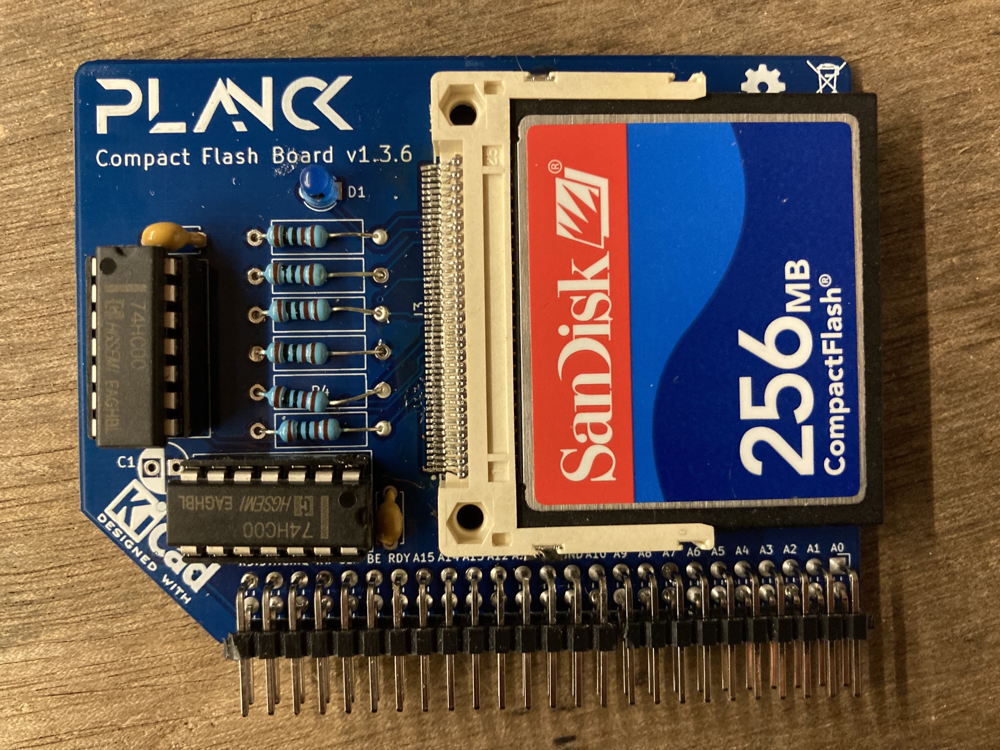

## Compact Flash board

This board allows adding one Compact Flash (CF) card to the Planck computer. This gives mass storage capabilities to the computer.

The file system is not complete yet, but will probably be FAT16 to allow interoperability with PCs

You will be able to save and load files. 

It will be possible to load forth words and assembly code from the compact flash card.

You can [download the schematic](https://planck6502.com/fabrication/cf_board-schematic.pdf) and the [gerber files](https://planck6502.com/fabrication/cf_board-zip.zip)

[Documentation](https://planck6502.com/Hardware/cf/)

 This documentation is licensed under a <a rel="license" href="http://creativecommons.org/licenses/by-sa/4.0/">Creative Commons Attribution-ShareAlike 4.0 International License</a>.