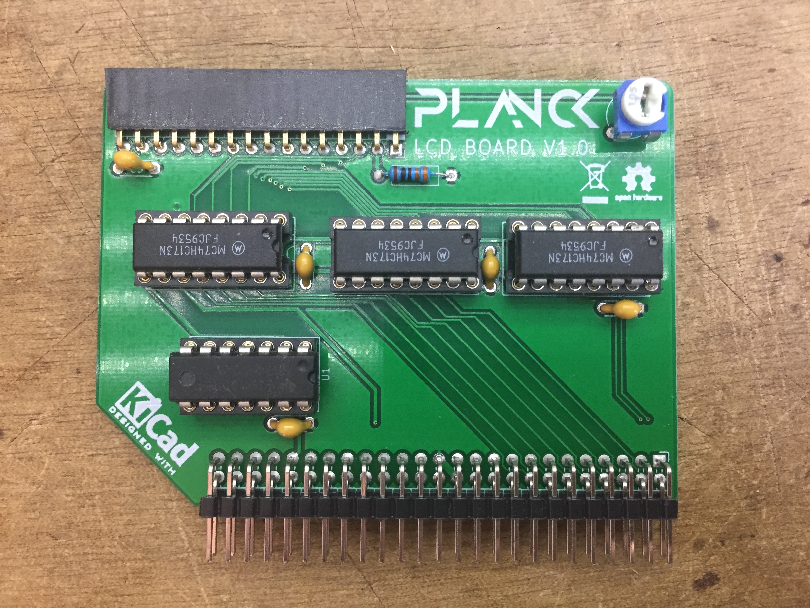

## Planck 6502 LCD board

This board allows adding a HD44780 based LCD to the Planck computer.

This is what the board looks like at the moment:

You can [download the schematic](https://gitlab.com/planck-6502/planck-6502/-/jobs/artifacts/develop/raw/Hardware/Fabrication/Schematic.pdf?job=lcd_out)

 This documentation is licensed under a <a rel="license" href="http://creativecommons.org/licenses/by-sa/4.0/">Creative Commons Attribution-ShareAlike 4.0 International License</a>.