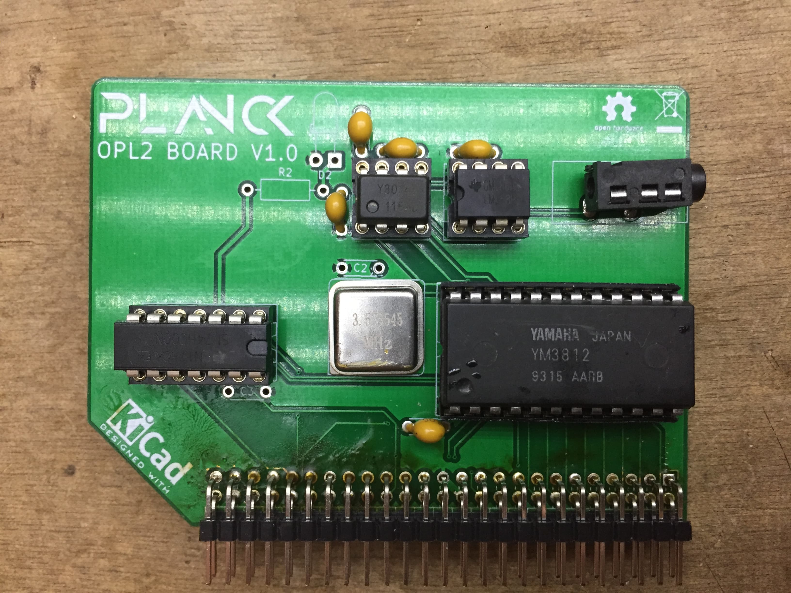

## Planck 6502 sound card

This is a sound card based on the YM3892 OPL2 sound chip.

You can [download the schematic](https://gitlab.com/planck-6502/planck-6502/-/jobs/artifacts/develop/raw/Hardware/Fabrication/Schematic.pdf?job=opl_out) and the [gerber files](https://gitlab.com/planck-6502/planck-6502/-/jobs/artifacts/develop/raw/Hardware/Fabrication/gerbers.zip?job=opl_out)

[Documentation](https://planck6502.com/Hardware/opl2/)

 This documentation is licensed under a <a rel="license" href="http://creativecommons.org/licenses/by-sa/4.0/">Creative Commons Attribution-ShareAlike 4.0 International License</a>.