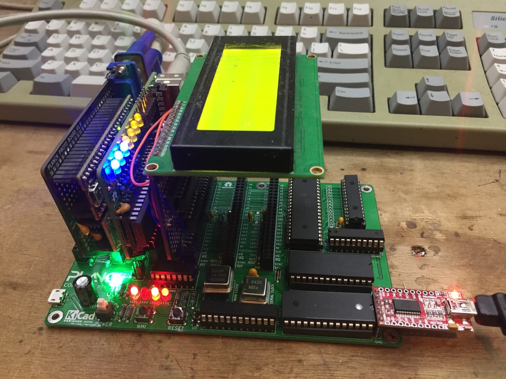

# An open hardware, extensible 65c02 based computer

This is a hobby computer based on the 65C02 processor. (I use 6502 and 65C02 interchangeably in this document, but [there are some differences](http://wilsonminesco.com/NMOS-CMOSdif/))

There are already many computers based on the 6502 processor, old ones such as as the Apple 1, Apple II, Commodore 64 and many more; and many more recent ones, from homebrew affairs on prototype board, to complete replicas of old systems.

The one that most closely resembles the Planck is probably the RC6502, itself based on the RC2014 (which uses a Z80 processor) with adaptations to the expansion bus to make it fit the 6502 processor.

Planck is a new variant on this type of expandable machines with a different set of tradeoffs.

### Contraints and requirements

The constraints for it's design were the following:

  - 100x100mm maximum board size, 2 layers, as that is the size that is often cheapest to have fabricated.
  - Easily extensible with for example:
    - Serial port
    - Parallel port
    - SPI / SPI65B port
    - PS/2 port for keyboard
    - Sound card
    - eventually VGA out
  - Target clock speed of 10 to 12 MHz

## Some details

These requirements resulted in a computer based on a backplane and separate boards that plug into it. A backplane is a mostly passive board that just interconnects all the cards that provide actual functionality together.

The [Planck hardware pages](/Hardware) explains more about the functionality of the backplane and of each basic extension boards.

Of course, you can [design your own expansion boards](/Hardware/make) to make the computer do whatever **you** decide